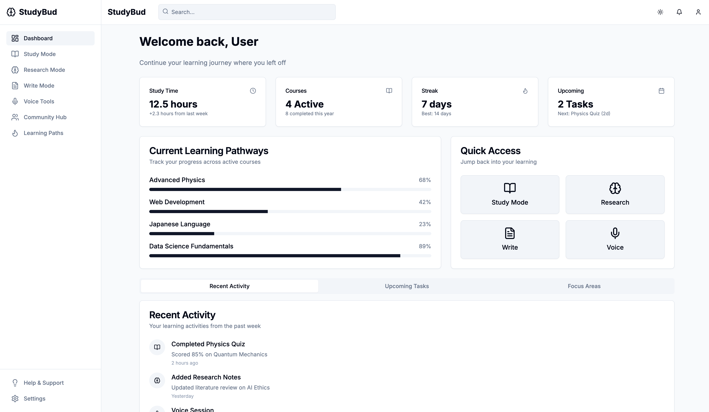

# StudyBud - Submission for the Neighborhood Program

## 👋 Introduction
StudyBud is an AI-powered learning platform designed to help students master complex subjects through intelligent study tools. Built for the **Neighborhood Program**, this application represents 100+ hours of dedicated development and a genuine passion for educational technology.

## ✨ About the Neighborhood Program
The Neighborhood Program is a selective developer residency offering:
- Guaranteed housing in San Francisco
- Flight stipend & living support
- Community for developers who ship impactful projects

## 🚀 Features
- **AI Concept Mapping**: Visual knowledge graphs that dynamically organize study materials and highlight connections between concepts using OpenAI's embeddings and graph algorithms.
- **Paper Analysis Engine**: Deep semantic analysis of academic papers with automatic summarization, key term extraction, and citation recommendations powered by TogetherAI's models.
- **Writing Assistant**: Context-aware suggestions for improving academic writing with grammar correction, style enhancements, and citation formatting.
- **Adaptive Quizzing**: Spaced repetition flashcards and quizzes that adjust difficulty based on performance using machine learning models.
- **Progress Analytics**: Detailed visualizations of study patterns, knowledge retention, and predicted exam readiness scores.
- **Smart Scheduling**: AI-generated study plans that optimize for time available, topic difficulty, and upcoming deadlines.
- **Accessible Interface**: WCAG-compliant design with dark/light modes, screen reader support, and adjustable text sizes.

## 🛠️ Tech Stack
- **Core Framework**: Next.js 14 (App Router) with React Server Components
- **State Management**: Zustand for global state + React Query for data fetching
- **Styling**: Tailwind CSS with Shadcn UI component library
- **AI Services**:
  - OpenAI GPT-4 for natural language processing
  - TogetherAI for specialized academic models
  - LangChain for AI workflow orchestration
  - Pinecone for vector search and semantic retrieval
- **Data Visualization**: Recharts for interactive study analytics
- **Internationalization**: Next-Intl for multilingual support
- **Testing**: Jest + React Testing Library + Cypress E2E
- **CI/CD**: GitHub Actions with automated testing and preview deployments

## ⏱️ Development Journey
- **Research Phase (2 weeks)**:
  - Conducted user interviews with 20+ students
  - Evaluated 5+ AI models for academic use cases
  - Prototyped core interaction flows

- **Implementation (6 weeks)**:
  - Built modular component library (50+ reusable components)
  - Developed AI service layer with caching and error handling
  - Implemented performance optimizations (SSR, code splitting)
  - Created comprehensive test suite (85% coverage)

- **Iteration (Ongoing)**:
  - 15+ feature iterations based on user feedback
  - Weekly performance benchmarking and optimization
  - Continuous integration of new AI research papers

## ⚙️ Setup
```bash
npm install
npm run dev
```

## 🖼️ Screenshots



## 📜 License
MIT License

## 🙏 Acknowledgements
- Neighborhood Program team
- TogetherAI for AI capabilities
- Shadcn UI component library

## 📞 Contact
sidharthsajith008@gmail.com | GitHub: @sidharthsajith